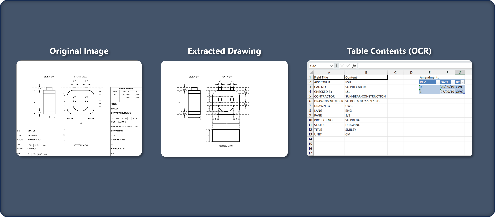

# Blueprint Information Extractor

A Python-based tool that automates the extraction of relevant information from engineering blueprints by isolating the drawings from tables. Subsequently, key data points such as drawing numbers, authors, titles are extracted using Optical Character Recognition (OCR).

## Main Features

- Process blueprint images to extract engineering drawings.
- Automatic extraction of key information from engineering drawings.
- Removal of unnecessary lines, borders, and annotations to enhance  accuracy.
- Identification and extraction of data points from the tables in the image.

## Usage

1. **Install Dependencies:** Ensure the required dependencies are installed. Refer to the [Dependencies](#dependencies) section for details.

2. **Prepare Images:** Engineering drawing images used for the project are placed in the `images` folder with 2-digit numerical names (e.g. "`01.png`").

3. **Run the Script:** Execute the `mainExtractionOCR.py` script using Python. The script will process the images and extract relevant information.

4. **Output:** Extracted data will be saved in an Excel file named `drawingInfo.xlsx`. Processed images will be saved in the `extracted` folder.

## Dependencies

Please ensure that the following libraries are installed before running the program.
- Python 3.x
- OpenCV
- Tesseract OCR
- NumPy
- openpyxl
- matplotlib

```properties
pip install opencv-python pytesseract numpy openpyxl matplotlib
```

## Sample Outputs

